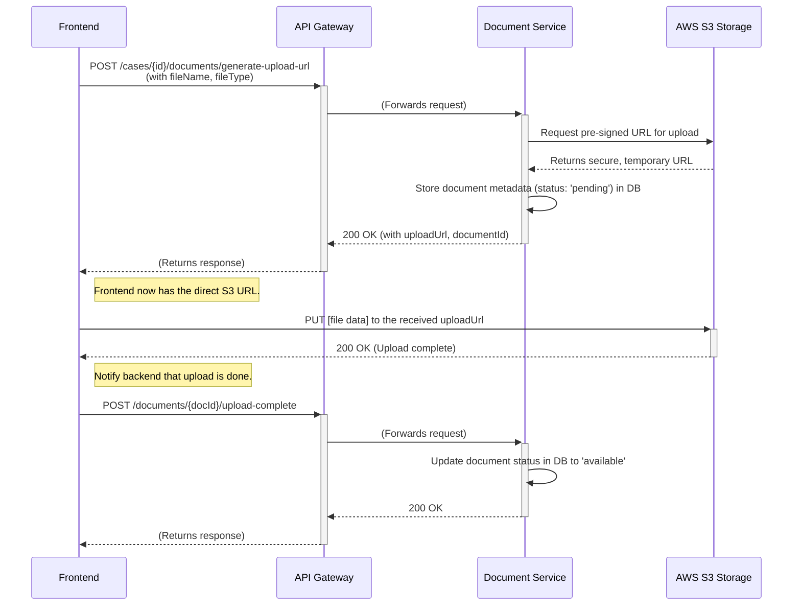
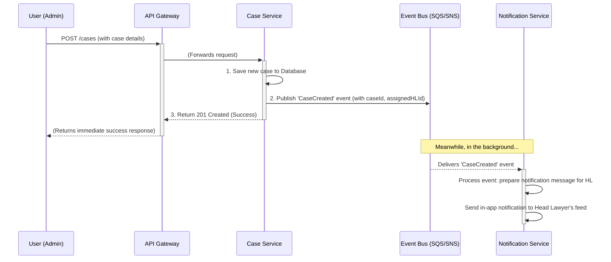

### **API Layer**
*Defining the communication protocols, endpoints, and data structures that enable the frontend, backend services, and external systems to interact reliably and securely.*

---

### **Deliverable: API Endpoint List**

This is a RESTful API organized by the microservices defined in the System Layer. All endpoints are prefixed by the service name for clarity (e.g., `/api/v1/cases/...`). The API Gateway will route requests to the correct service.

**Auth Service (`/api/v1/auth`)**
*   `POST /login`: Authenticate a user and return a JWT access token.
*   `POST /logout`: Invalidate a user's session.
*   `POST /refresh`: Obtain a new access token using a refresh token.

**Case Management Service (`/api/v1/`)**
*   **Clients:**
    *   `GET /clients`: Get a list of all clients.
    *   `POST /clients`: Create a new client.
    *   `GET /clients/{clientId}`: Get details for a single client.
*   **Cases:**
    *   `GET /cases`: Get a list of cases (filtered based on user's role and assignments).
    *   `POST /cases`: Create a new legal case.
    *   `GET /cases/{caseId}`: Get comprehensive details for a single case, including its team, documents, and tasks.
    *   `PUT /cases/{caseId}`: Update the core details of a case (e.g., status, priority).
*   **Assignments:**
    *   `POST /cases/{caseId}/assignments`: Assign or un-assign lawyers (HL, SL, OL) to a case.

**CRM Service (`/api/v1/`)**
*   **Contacts:**
    *   `GET /contacts`: Get a list of all contacts.
    *   `POST /contacts`: Create a new contact.
    *   `GET /contacts/{contactId}`: Get details for a single contact.
*   **Deals / Pipeline:**
    *   `GET /deals`: Get all deals, typically to populate the sales pipeline board.
    *   `PUT /deals/{dealId}`: Update a deal, most commonly to change its `stage`.
*   **Tasks:**
    *   `GET /tasks`: Get a list of tasks assigned to the current user.
    *   `POST /tasks`: Create a new task.
    *   `PATCH /tasks/{taskId}`: Update a task (e.g., mark as complete).

**Document Service (`/api/v1/`)**
*   `GET /cases/{caseId}/documents`: Get a list of metadata for all documents associated with a case.
*   `POST /cases/{caseId}/documents/generate-upload-url`: **(Critical)** Request a secure, short-lived URL to upload a file directly to cloud storage (e.g., S3).
*   `GET /documents/{docId}/generate-download-url`: Request a secure, short-lived URL to download a file.

---

### **Deliverable: Request/Response Schema**

Here are examples of the data structures (payloads) for key API calls.

**1. Create a New Legal Case**
*   **Endpoint:** `POST /api/v1/cases`
*   **Request Body:**
    ```json
    {
      "clientId": "client-uuid-12345",
      "caseName": "CASE 25 - Civil Litigation",
      "caseType": "Civil", // Enum: "Civil", "Criminal", "Corporate Legal"
      "headLawyerIds": [
        "user-uuid-hl3"
      ],
      "description": "Initial filing regarding contract dispute with Supplier XYZ."
    }
    ```
*   **Success Response (201 Created):**
    ```json
    {
      "id": "case-uuid-abcde",
      "name": "CASE 25 - Civil Litigation",
      "type": "Civil",
      "status": "Open",
      "client": {
        "id": "client-uuid-12345",
        "name": "InnerWorks Groups"
      },
      "team": {
        "headLawyers": [
          { "id": "user-uuid-hl3", "name": "John Carter" }
        ],
        "subordinateLawyers": []
      },
      "createdAt": "2025-11-20T10:00:00Z"
    }
    ```

**2. Update a Deal's Stage in the Sales Pipeline**
*   **Endpoint:** `PUT /api/v1/deals/{dealId}`
*   **Request Body:**
    ```json
    {
      "stage": "Proposal" // Move the deal to the "Proposal" column
    }
    ```
*   **Success Response (200 OK):**
    ```json
    {
      "id": "deal-uuid-67890",
      "name": "Acme Inc - $55,000",
      "value": 55000,
      "stage": "Proposal", // Confirms the new stage
      "contact": {
        "id": "contact-uuid-xyz",
        "name": "Jane Doe"
      }
    }
    ```

**3. Generate a Secure Upload URL for a Document**
*   **Endpoint:** `POST /api/v1/cases/{caseId}/documents/generate-upload-url`
*   **Request Body:**
    ```json
    {
      "fileName": "client_agreement_signed.pdf",
      "fileType": "application/pdf"
    }
    ```
*   **Success Response (200 OK):**
    ```json
    {
      "documentId": "doc-uuid-qwerty", // ID to reference the doc in our DB
      "uploadUrl": "https://architectpulse-docs.s3.amazonaws.com/client_agreement_signed.pdf?AWSAccessKeyId=..." // The pre-signed URL
    }
    ```
    *(The frontend will then use this `uploadUrl` to `PUT` the file data directly to S3.)*

---

### **Deliverable: Auth & Roles per API**

Access to endpoints is protected and depends on the user's role, which is encoded in their JWT token. An Authorization Middleware in the API Gateway checks this on every request.

| Endpoint | Method | Required Role(s) | Description |
| :--- | :--- | :--- | :--- |
| `POST /auth/login` | POST | **Public** | Anyone can attempt to log in. |
| `GET /cases` | GET | Admin, Head Lawyer, Subordinate | All legal users can view cases, but the results are filtered to only show what they are assigned to. |
| `POST /cases` | POST | **Admin** | Only Admins can create new cases for the firm. |
| `PUT /cases/{caseId}`| PUT | Admin, Head Lawyer | Only the case manager (HL) or an Admin can change case status. |
| `POST /cases/{caseId}/assignments` | POST | Admin, Head Lawyer | An Admin can assign an HL; an HL can assign SLs/OLs to a case they manage. |
| `POST /.../generate-upload-url` | POST | Head Lawyer, Subordinate | Any lawyer assigned to the case can upload documents. |
| `GET /deals` | GET | Sales Manager | Only sales-focused roles can see the sales pipeline. |
| `PUT /deals/{dealId}` | PUT | Sales Manager | Only sales-focused roles can modify deals. |

---

### **Deliverable: Sequence Diagrams**

These diagrams illustrate the step-by-step interactions between systems for critical user flows.

#### **Sequence Diagram 1: Secure Document Upload Flow**

This flow is designed to be secure and efficient, preventing large files from overwhelming our backend services.



#### **Sequence Diagram 2: Asynchronous Case Creation and Notification**

This flow shows how the event-driven architecture provides a fast response to the user while background tasks are handled separately.


