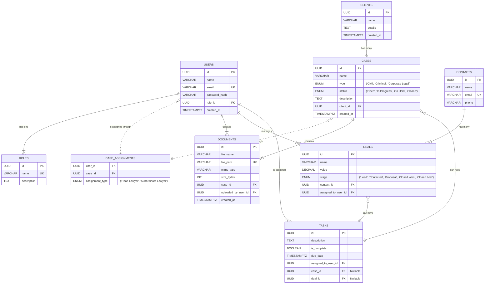

### **Data Layer (DB Schema)**
*Defining the structure, relationships, and constraints for the data that powers the ArchitectPulse application. This schema is designed for a relational database like PostgreSQL.*

---

### **Deliverable: Entity-Relationship Diagram (ERD)**

This diagram visually represents the database tables (entities) and the relationships between them.

---

### **Deliverable: Database Schema**

This section provides the detailed `CREATE TABLE` like structure for each entity.

**Table: `roles`**
| Column Name | Data Type | Constraints / Notes |
| :--- | :--- | :--- |
| `id` | UUID | PRIMARY KEY, default: `gen_random_uuid()` |
| `name` | VARCHAR(50) | NOT NULL, UNIQUE (e.g., 'Admin', 'Head Lawyer', 'Subordinate Lawyer', 'Sales Manager') |
| `description`| TEXT | NULLABLE |

**Table: `users`**
| Column Name | Data Type | Constraints / Notes |
| :--- | :--- | :--- |
| `id` | UUID | PRIMARY KEY |
| `name` | VARCHAR(255)| NOT NULL |
| `email` | VARCHAR(255)| NOT NULL, UNIQUE, INDEX |
| `password_hash`| VARCHAR(255)| NOT NULL |
| `role_id` | UUID | NOT NULL, FOREIGN KEY references `roles(id)` |
| `created_at` | TIMESTAMPTZ| NOT NULL, default: `now()` |
| `updated_at` | TIMESTAMPTZ| NOT NULL, default: `now()` |

**Table: `clients`**
| Column Name | Data Type | Constraints / Notes |
| :--- | :--- | :--- |
| `id` | UUID | PRIMARY KEY |
| `name` | VARCHAR(255)| NOT NULL, INDEX |
| `details` | TEXT | NULLABLE |
| `created_at` | TIMESTAMPTZ| NOT NULL, default: `now()` |

**Table: `cases`**
| Column Name | Data Type | Constraints / Notes |
| :--- | :--- | :--- |
| `id` | UUID | PRIMARY KEY |
| `name` | VARCHAR(255)| NOT NULL, INDEX |
| `type` | ENUM | ('Civil', 'Criminal', 'Corporate Legal') |
| `status` | ENUM | ('Open', 'In Progress', 'On Hold', 'Closed'), default: 'Open', INDEX |
| `description`| TEXT | NULLABLE |
| `client_id` | UUID | NOT NULL, FOREIGN KEY references `clients(id)` |
| `created_at` | TIMESTAMPTZ| NOT NULL, default: `now()` |

**Table: `case_assignments` (Join Table)**
| Column Name | Data Type | Constraints / Notes |
| :--- | :--- | :--- |
| `user_id` | UUID | FOREIGN KEY references `users(id)`, part of composite PRIMARY KEY |
| `case_id` | UUID | FOREIGN KEY references `cases(id)`, part of composite PRIMARY KEY |
| `assignment_type`| ENUM | ('Head Lawyer', 'Subordinate Lawyer'), NOT NULL |

**Table: `documents`**
| Column Name | Data Type | Constraints / Notes |
| :--- | :--- | :--- |
| `id` | UUID | PRIMARY KEY |
| `file_name` | VARCHAR(255)| NOT NULL |
| `file_path` | VARCHAR(1024)| NOT NULL, UNIQUE (Path in S3 or other object store) |
| `mime_type` | VARCHAR(100)| e.g., 'application/pdf' |
| `size_bytes` | BIGINT | File size |
| `case_id` | UUID | NOT NULL, FOREIGN KEY references `cases(id)`, INDEX |
| `uploaded_by_user_id`| UUID | NOT NULL, FOREIGN KEY references `users(id)` |
| `created_at` | TIMESTAMPTZ| NOT NULL, default: `now()` |

**Table: `contacts`**
| Column Name | Data Type | Constraints / Notes |
| :--- | :--- | :--- |
| `id` | UUID | PRIMARY KEY |
| `name` | VARCHAR(255)| NOT NULL |
| `email` | VARCHAR(255)| UNIQUE, INDEX |
| `phone` | VARCHAR(50) | NULLABLE |

**Table: `deals`**
| Column Name | Data Type | Constraints / Notes |
| :--- | :--- | :--- |
| `id` | UUID | PRIMARY KEY |
| `name` | VARCHAR(255)| NOT NULL |
| `value` | DECIMAL(12, 2) | Monetary value of the deal |
| `stage` | ENUM | ('Lead', 'Contacted', 'Proposal', 'Closed Won', 'Closed Lost'), default: 'Lead', INDEX |
| `contact_id` | UUID | FOREIGN KEY references `contacts(id)` |
| `assigned_to_user_id`| UUID | NOT NULL, FOREIGN KEY references `users(id)` |

**Table: `tasks`**
| Column Name | Data Type | Constraints / Notes |
| :--- | :--- | :--- |
| `id` | UUID | PRIMARY KEY |
| `description`| TEXT | NOT NULL |
| `is_complete`| BOOLEAN | NOT NULL, default: `false`, INDEX |
| `due_date` | TIMESTAMPTZ| NULLABLE |
| `assigned_to_user_id`| UUID | NOT NULL, FOREIGN KEY references `users(id)` |
| `case_id` | UUID | NULLABLE, FOREIGN KEY references `cases(id)` (Polymorphic relation) |
| `deal_id` | UUID | NULLABLE, FOREIGN KEY references `deals(id)` (Polymorphic relation) |

---

### **Deliverable: Data Dictionary**

*   **`roles`**: Stores the defined user roles within the system. This controls permissions.
    *   `name`: The unique identifier for the role (e.g., 'Admin').
*   **`users`**: Represents an individual who can log in to the system.
    *   `password_hash`: A securely hashed version of the user's password (never store plain text).
*   **`clients`**: The top-level entity for a firm's customer (e.g., a company).
*   **`cases`**: Represents a specific legal matter or project for a client.
    *   `type`: Categorizes the case based on legal specialty.
    *   `status`: Tracks the current lifecycle stage of the case.
*   **`case_assignments`**: A mapping table that links users to cases and defines their role in that specific case. This is the core of the hierarchical assignment engine.
    *   `assignment_type`: Specifies if the user is a manager (Head Lawyer) or a contributor (Subordinate Lawyer) for this particular case.
*   **`documents`**: Stores metadata about files uploaded for a case.
    *   `file_path`: The unique key/path to the actual file object in a cloud storage bucket like S3. The file itself is not stored in the database.
*   **`contacts`**: Represents individual people, typically leads or customers in the CRM module.
*   **`deals`**: Represents a potential sale or opportunity being tracked in the sales pipeline.
    *   `value`: The potential monetary worth of the deal.
    *   `stage`: The current step in the sales process.
*   **`tasks`**: A single to-do item or action.
    *   `case_id`/`deal_id`: These nullable foreign keys create a polymorphic relationship. A task can belong to a case, a deal, or neither (a general user task), but not both.

---

### **Deliverable: Migration & Seed Plan**

**Migration Plan:**
A database migration tool (e.g., `Alembic` for Python, `Flyway` for Java, `Knex.js Migrations` for Node.js) will be used to manage schema changes versionally.

1.  **Initial Migration Script (`001_initial_schema.sql`):**
    *   Create tables in order of dependency:
        1.  `roles`
        2.  `users` (depends on `roles`)
        3.  `clients`
        4.  `cases` (depends on `clients`)
        5.  `case_assignments` (depends on `users`, `cases`)
        6.  `documents` (depends on `cases`, `users`)
        7.  `contacts`
        8.  `deals` (depends on `contacts`, `users`)
        9.  `tasks` (depends on `users`, `cases`, `deals`)
    *   Add all necessary indexes after tables are created.
2.  **Subsequent Migrations:** Any future schema change (e.g., adding a new column to the `cases` table) will be a new, timestamped migration file. This ensures that any developer's database can be brought up to the latest version by simply running the migration command.

**Seed Plan (for Development & Testing):**
A seeding script will be created to populate the database with initial data, making the application usable immediately after setup.

1.  **Seed Roles:**
    *   Create the four essential roles: 'Admin', 'Head Lawyer', 'Subordinate Lawyer', 'Sales Manager'.
2.  **Seed Users:**
    *   Create one user for each role (e.g., `admin@architectpulse.com`, `hl@architectpulse.com`, etc.) with a default password.
3.  **Seed CRM Data (for Sales Module testing):**
    *   Create 5-10 `contacts` (Jane Doe, John Smith, etc.).
    *   Create several `deals` for these contacts, placing them in different `stage`s of the pipeline to mimic the mockup.
    *   Assign these deals to the 'Sales Manager' user.
    *   Create a few `tasks` related to these deals.
4.  **Seed Legal Data (for Legal Module testing):**
    *   Create 2 `clients` (e.g., 'InnerWorks Groups', 'Acme Inc').
    *   Create 4-5 `cases` for these clients with different `type`s.
    *   Assign the 'Head Lawyer' user to all cases via `case_assignments`.
    *   Assign the 'Subordinate Lawyer' user to 2-3 of those cases via `case_assignments`.
    *   Create a few `tasks` related to these cases.
